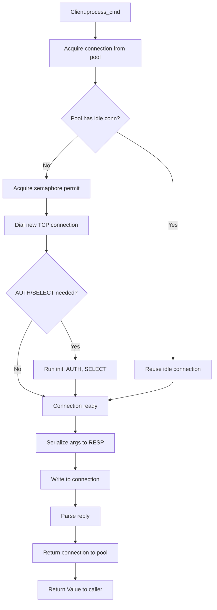
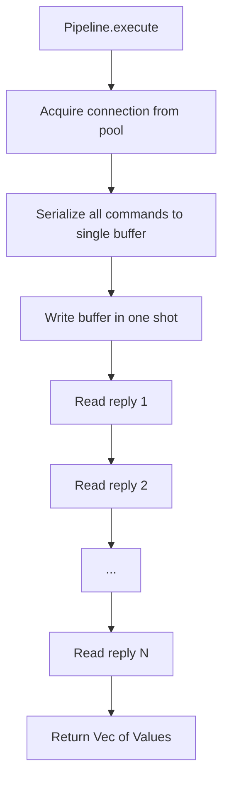
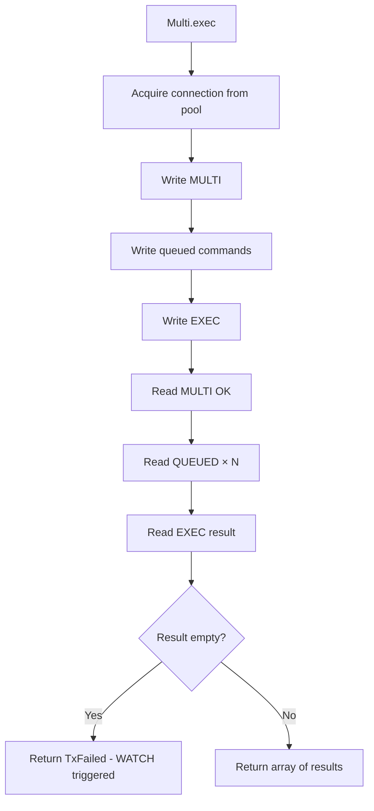
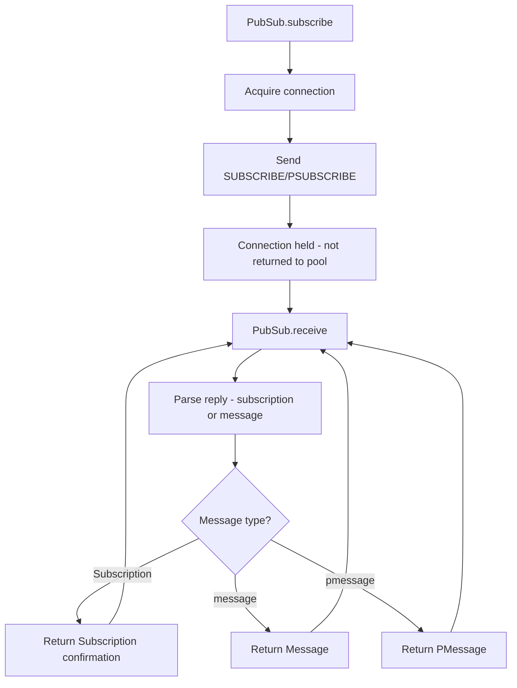
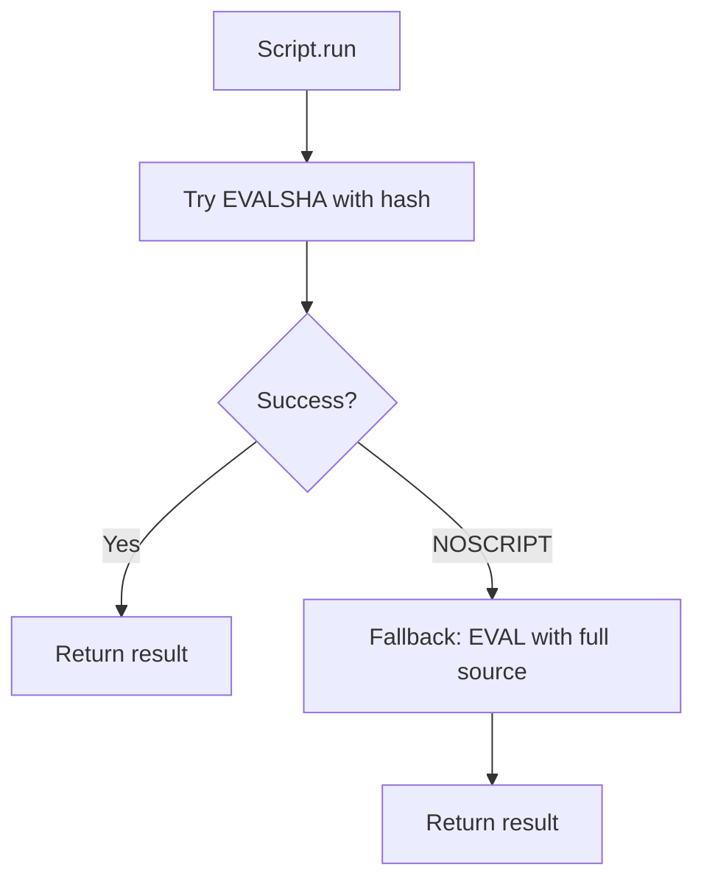
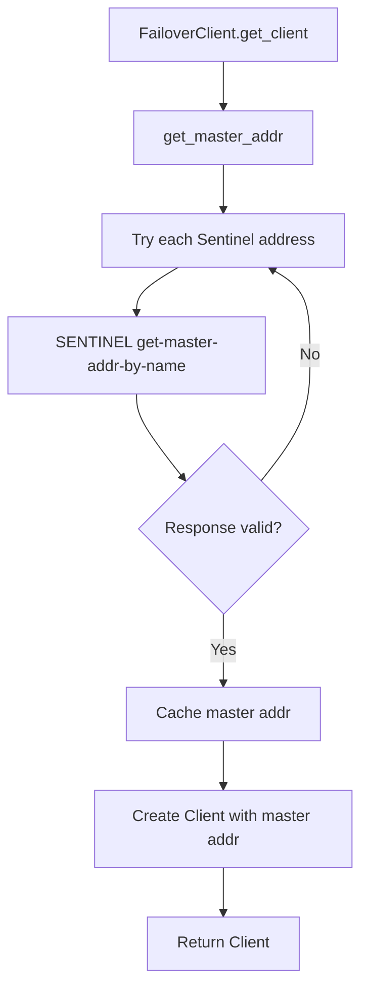

# Architecture & Business Process Flow

## Architecture

```
┌─────────────────────────────────────────────────────────────────────────────────┐
│                              Application Layer                                    │
├─────────────────────────────────────────────────────────────────────────────────┤
│  Client  │  Pipeline  │  Multi (Transaction)  │  PubSub  │  Script  │ FailoverClient │
└────┬────────────┬────────────┬────────────────────┬────────────┬────────────┬────┘
     │            │            │                    │            │            │
     └────────────┴────────────┴────────────────────┴────────────┴────────────┘
                                      │
                                      ▼
┌─────────────────────────────────────────────────────────────────────────────────┐
│                           Connection Pool (ConnPool)                              │
│  ┌─────────┐ ┌─────────┐ ┌─────────┐     ┌─────────┐  Semaphore (pool_size)     │
│  │ Idle    │ │ Idle    │ │ Idle    │ ... │ Idle    │  Idle timeout eviction     │
│  │ Conn 1  │ │ Conn 2  │ │ Conn 3  │     │ Conn N  │                             │
│  └────┬────┘ └────┬────┘ └────┬────┘     └────┬────┘                             │
└───────┼──────────┼──────────┼────────────────┼──────────────────────────────────┘
        │          │          │                │
        └──────────┴──────────┴────────────────┘
                          │
                          ▼
┌─────────────────────────────────────────────────────────────────────────────────┐
│                         Connection (TcpStream + BufReader)                        │
│  • AUTH / SELECT on init  • Read/Write timeouts  • RESP serialization             │
└─────────────────────────────────────────────────────────────────────────────────┘
                          │
                          ▼
┌─────────────────────────────────────────────────────────────────────────────────┐
│                              Parser (RESP Protocol)                               │
│  Value types: Status, Error, Int, BulkString, Nil, Array                         │
└─────────────────────────────────────────────────────────────────────────────────┘
                          │
                          ▼
┌─────────────────────────────────────────────────────────────────────────────────┐
│                              Redis Server (TCP :6379)                             │
└─────────────────────────────────────────────────────────────────────────────────┘
```

## Business Process Flow

### Single Command Execution Flow



### Pipeline Execution Flow



### Transaction (MULTI/EXEC) Flow



### Pub/Sub Flow



### Lua Script Execution Flow



### Sentinel Failover Flow


